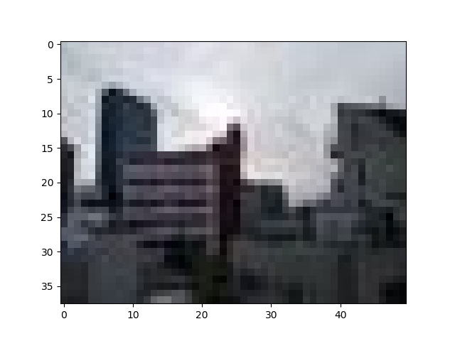

# PanoramicStitching
This a beginner cv project to simulate Brown and Lowe's Automatic Panoramic Image Stitching technology using SIFT detection. All code written here is written by Jiro Mizuno unless commented so.

## SIFT detection
I will use SIFT (Scale Invariant Feature Transform) feature points to compare and eventually stitch together photos in this project. Most of my code is based on the original paper by David Lowe: *Distinctive Image Features from Scale-Invariant Keypoints*.

### Usage
1. Clone the repo
2. Insert your picture in the workspace somewhere.
3. Go to terminal and type:
```
python.exe sift.py ADDRESS_OF_PICTURE1 ADDRESS_OF_PICTURE2
```

### Results so far #1
This is the sample picture used so far to measure SIFT points "Skyline1.jpg":


This is the minimized picture used so far to lessen caculation time:


The red dots indicate the sift points detected in skyline1:


The red lines indicate possible matches between similar keypoints. In this case we are comparing smolSkyline.jpg and a -90 degrees rotated image of the former:


As seen in the comparison, my algorithm generally detects the same keypoints in both images, proving its functionality limitedly.

### Results so far #2
Next I used two similar photos to compare my sift points "Skyline21.jpg" and "Skyline22.jpg"


Then I minimized them to compare points for testing. Also here is a zoomed picture "skyline21.jpg"



The results for most likely matching points are hard to see in the comparison. But following the approximate lines appear to show generally correct assessments.

